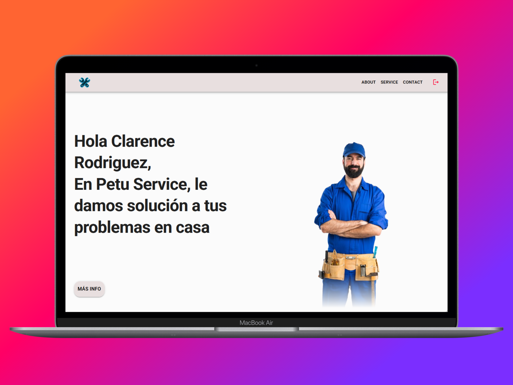
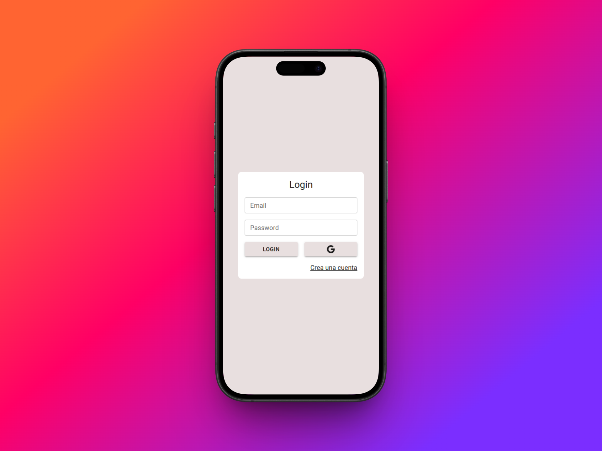

# 💼 Enterprise Dashboard & User Portal

A production-ready enterprise web application featuring a secure authentication system, protected routing, Perfect structure for SaaS platforms and private corporate portals.

## 🌐 Live Demo
[👉 Click here to view the live application](https://technical-service-one.vercel.app/)

## 🛠️ Tech Stack
* **Frontend:** React, Vite, React Router DOM.
* **UI Component Library:** Material UI (MUI).
* **Backend-as-a-Service:** Firebase Auth.

## ✨ Key Features
* **Secure Authentication:** User Login and Registration system securely handled by Firebase.
* **Protected Routes:** Unauthorized users are automatically redirected to login, protecting sensitive data within the dashboard.
* **Professional UI/UX:** Built with clean corporate components using Material UI, fully adaptive, responsive.

## 📸 Interface Preview
<p align="center">
   
   
</p>

## ⚙️ Local Setup Instructions

1. **Clone the repository:**
```bash
   git clone https://github.com/Carlosmarrano/TechnicalService.git
```

2. **Install dependencies:**


```Bash
   npm install
```

3. **Firebase Configuration:**
```
Create a .env file in the root directory.

Add your Firebase configuration keys (using the VITE_FIREBASE_... prefix).
```

4. **Launch the project:**

```Bash
   npm run dev
```